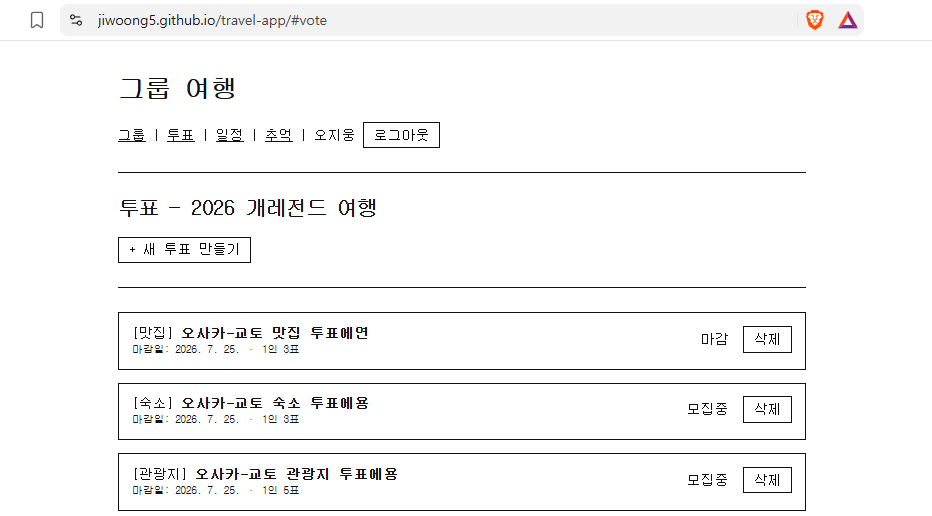
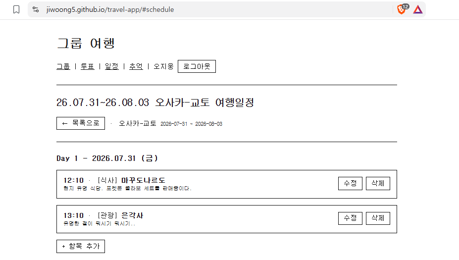
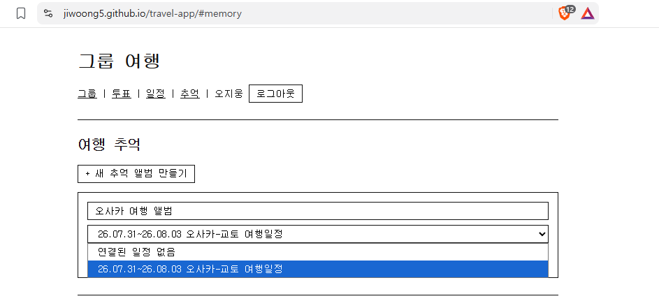

# 그룹 여행 플랫폼 (travel-app)

2인 이상 그룹 여행자가 **여행 전 계획부터 여행 후 추억 관리까지** 한 곳에서 처리하는 웹 플랫폼.

여행지를 투표로 정하고 → 숙소·관광지·맛집을 투표로 좁히고 → 날짜별 일정을 함께 짜고 → 다녀온 뒤 사진을 공동 앨범에 모은다.

별도 서버 없이 **브라우저가 Firebase SDK로 직접 Firestore/Storage에 접근**하는 서버리스 구조이며, 빌드 결과물은 GitHub Pages로 배포된다.

- 배포 주소: https://jiwoong5.github.io/travel-app/
- 디자인 방침: CSS 최소화, 기능 중심의 투박한(bare-bones) 인터페이스

---

## 핵심 기능

| 기능 | 설명 | 기획서 |
|------|------|--------|
| 투표 | 여행지 / 숙소 / 관광지 / 맛집 후보를 등록하고 그룹원이 투표해 확정. 네 유형이 동일한 데이터 모델을 공유하고 `voteType`으로 구분 | [기획서_여행지투표.md](기획서_여행지투표.md) |
| 여행 일정 관리 | 확정된 여행지의 날짜별 일정을 그룹이 함께 작성. 마감된 관광지 투표의 당선 항목을 드롭다운으로 바로 삽입 | [기획서_여행일정관리.md](기획서_여행일정관리.md) |
| 여행 추억 관리 | 여행 후 사진·코멘트를 공동 앨범에 업로드. 일정 항목과 연결하면 장소별로 그룹핑되어 표시 | [기획서_여행추억관리.md](기획서_여행추억관리.md) |
| 그룹(방) | 여행 단위로 그룹을 만들고 초대 코드로 합류. 그룹별 데이터는 독립 관리 | [기획서_전체개요.md](기획서_전체개요.md) |

### 사용자 흐름

```
[그룹 생성 / 초대]
       |
       v
[여행지 투표] → 후보 모집 → 투표 → 여행지 확정
       |
       v
[숙소·관광지·맛집 투표] → 후보 모집 → 투표 → 확정
       |
       v
[여행 일정 관리] → 날짜/장소/메모 입력  ← (관광지 투표 당선 항목 자동 삽입)
       |
       v
[여행 추억 관리] → 사진 업로드 → 코멘트 → 앨범 열람
```

투표는 `recruiting(후보 모집 중)` → `ongoing(투표 중)` → `closed(마감)` 순으로 진행되며, 1인 1표는 투표 기록 문서 ID를 `userId`로 쓰는 방식으로 강제된다.

### 화면

**투표 목록** — 그룹의 투표를 유형 배지(`[맛집]` `[숙소]` `[관광지]`)와 상태 배지(`모집중` / `마감`)로 구분해 보여준다.



**여행 일정** — 여행 기간을 Day별 섹션으로 나누고, 각 항목에 시간·카테고리·장소명·메모를 표시한다. 시간이 있는 항목이 먼저 정렬된다.



**추억 앨범** — 앨범을 만들 때 그룹의 여행 일정을 골라 연결하면, 이후 업로드한 사진을 일정 항목의 장소별로 묶어 보여준다.



---

## 기술 스택

| 영역 | 기술 | 비고 |
|------|------|------|
| 프론트엔드 | Svelte 4 + Vite 5 | 컴파일 타임 반응형, 런타임 없음 |
| DB | Firebase Firestore | `onSnapshot` 실시간 구독 |
| 인증 | Firebase Authentication | Google 로그인 단일 방식 |
| 파일 저장 | Firebase Storage | 추억 앨범 사진 |
| 지도 | Google Maps Embed API | 후보 카드 인라인 지도 |
| 배포 | GitHub Pages + GitHub Actions | `main` push 시 자동 배포 |

데이터 흐름은 단방향이다:

```
Firestore → onSnapshot → Svelte store → UI 자동 재렌더링
```

프레임워크·패턴·라우팅 선택 근거는 [ADR.md](ADR.md), 데이터 모델과 보안 규칙 등 구현 명세는 [TECH_SPEC.md](TECH_SPEC.md) 참고.

---

## 실행 방법

### 요구 사항

- Node.js 20 (`.nvmrc`에 고정 — nvm 사용 시 `nvm use`)
- Firebase 프로젝트 (Authentication / Firestore / Storage 활성화)
- Google Maps Embed API 키

### 설치 및 개발 서버

```bash
nvm use            # .nvmrc 읽어 Node 20으로 전환
npm install
npm run dev
```

브라우저에서 **http://localhost:5173/travel-app/** 접속 (Vite `base`가 `/travel-app/`이라 경로 끝까지 필요하다). `Ctrl+C`로 종료.

> **Windows 참고** — Node가 `AppData\Local\nodejs`에 설치되어 PATH에 안 잡히는 환경이면, 터미널을 열 때마다 PowerShell에서 아래를 먼저 실행한다. CMD는 지원하지 않는다.
> ```powershell
> $env:Path = "$env:LOCALAPPDATA\nodejs;" + $env:Path
> ```

### 빌드 / 미리보기

```bash
npm run build      # dist/ 에 정적 파일 생성
npm run preview    # 빌드 결과를 로컬에서 확인
```

### 환경 변수

`.env.local.example`을 `.env.local`로 복사한 뒤 값을 채운다. 이 값이 없으면 Firebase 연결이 되지 않는다.

```
VITE_FIREBASE_API_KEY=
VITE_FIREBASE_AUTH_DOMAIN=
VITE_FIREBASE_PROJECT_ID=
VITE_FIREBASE_STORAGE_BUCKET=
VITE_FIREBASE_MESSAGING_SENDER_ID=
VITE_FIREBASE_APP_ID=
VITE_MAPS_API_KEY=
```

`.env.local`은 `.gitignore`에 등록되어 있다. **API 키를 소스코드에 하드코딩하지 않는다.**

---

## 배포

`main` 브랜치에 push하면 [.github/workflows/deploy.yml](.github/workflows/deploy.yml)이 빌드 후 `gh-pages` 브랜치에 자동 배포한다.

배포가 동작하려면 위 `VITE_*` 환경 변수 7개가 모두 **GitHub Secrets**에 등록되어 있어야 한다 (Settings → Secrets and variables → Actions). Actions가 빌드 시 주입한다.

### Firebase 보안 규칙

`firestore.rules` / `storage.rules`는 레포에 있지만 **자동 배포되지 않는다.** 규칙을 수정했다면 Firebase Console에 직접 붙여넣고 게시해야 반영된다.

https://console.firebase.google.com/project/vacation-project-001/firestore/rules

규칙 요지:

- 그룹 문서의 `memberIds`에 포함된 사용자만 해당 그룹의 하위 데이터를 읽고 쓸 수 있다
- 그룹 삭제는 생성자만, 투표 삭제는 투표 생성자만 가능
- 투표 기록(`records`)은 문서 ID가 `userId`와 일치할 때만 쓸 수 있다 → 1인 1표
- Storage 업로드는 이미지 타입 + 10MB 미만만 허용

---

## 프로젝트 구조

```
travel-app/
├── .github/workflows/deploy.yml   # main push → 빌드 & gh-pages 배포
├── docs/screenshots/              # README용 화면 캡처
├── index.html                     # 진입점
├── src/
│   ├── main.js                    # Svelte 앱 마운트
│   ├── App.svelte                 # 루트 컴포넌트 (해시 라우터 + 로그인)
│   ├── firebase.js                # auth / db / storage 초기화
│   ├── style.css                  # 전역 스타일 (최소)
│   ├── stores/
│   │   ├── auth.js                # 로그인 사용자 (user store)
│   │   └── group.js               # 현재 선택된 그룹 (currentGroup store)
│   ├── pages/
│   │   ├── Groups.svelte          # 그룹 목록 / 생성 / 초대
│   │   ├── Vote.svelte            # 투표 (여행지·숙소·관광지·맛집)
│   │   ├── Schedule.svelte        # 여행 일정 관리
│   │   └── Memory.svelte          # 여행 추억 앨범
│   └── utils/
│       ├── maps.js                # Google Maps Embed URL 생성
│       └── compress.js            # 업로드 전 이미지 압축 (Canvas API)
├── firestore.rules / storage.rules / firebase.json
├── cors.json                      # Storage CORS 설정
└── vite.config.js                 # Svelte 플러그인 + base 경로
```

### 라우팅

라이브러리 없이 `App.svelte`에서 해시 라우팅을 직접 구현했다 (GitHub Pages 404 문제 회피 — [ADR-003](ADR.md)).

| 해시 | 화면 |
|------|------|
| `#groups` (기본값) | 그룹 목록 / 생성 / 초대 |
| `#vote` | 투표 |
| `#schedule` | 여행 일정 |
| `#memory` | 추억 앨범 |

---

## 개발 시 주의사항

- **Svelte 반응성**: 템플릿이나 `$:` 선언에서 반응형 변수를 **함수로 감싸면 의존성이 추적되지 않는다.** `{#each getItems(date) as ...}` 같은 코드는 데이터가 바뀌어도 다시 그려지지 않으므로, `$:` 파생 값을 만들어 직접 참조해야 한다. 상세 사례와 해결책은 [KNOWN_ISSUES.md](KNOWN_ISSUES.md) 참고.
- **이미지 압축**: Storage 무료 플랜(5GB 저장 / 1GB 다운로드·일) 한도 안에서 운영하기 위해 업로드 전 브라우저에서 1MB 이하로 압축한다 (`utils/compress.js`). jpeg·png만 대상이며 gif·webp는 원본을 유지한다.
- **지도 URL**: 사용자가 붙여넣은 Google Maps URL에서 좌표 또는 place_id를 추출해 임베드하고, 실패하면 장소명 검색으로 fallback한다 (`utils/maps.js`).

---

## 문서

| 문서 | 내용 |
|------|------|
| [기획서_전체개요.md](기획서_전체개요.md) | 서비스 개요, 전체 사용자 흐름, 우선순위 |
| [기획서_여행지투표.md](기획서_여행지투표.md) | 투표 4종의 화면·데이터 모델·권한 규칙 |
| [기획서_여행일정관리.md](기획서_여행일정관리.md) | 일정 화면과 투표 연동 |
| [기획서_여행추억관리.md](기획서_여행추억관리.md) | 앨범·사진·코멘트 |
| [TECH_SPEC.md](TECH_SPEC.md) | Firestore 컬렉션 구조, Storage 경로, 배포 명세 |
| [ADR.md](ADR.md) | 아키텍처 결정 기록 (패턴 / 프레임워크 / 라우팅) |
| [KNOWN_ISSUES.md](KNOWN_ISSUES.md) | 알려진 함정과 해결책 |
| [실행방법.md](실행방법.md) | Windows 로컬 실행 상세 메모 |
